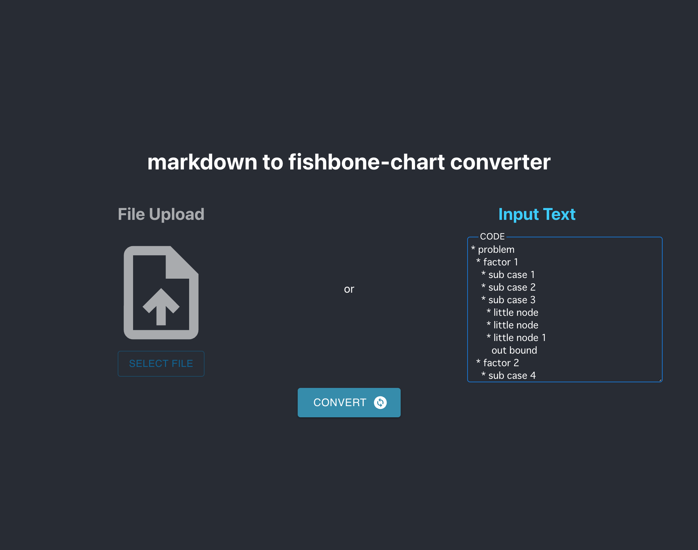
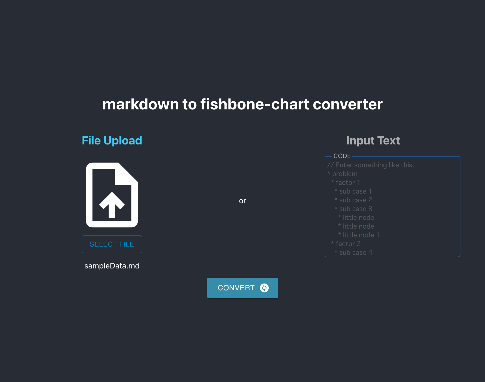
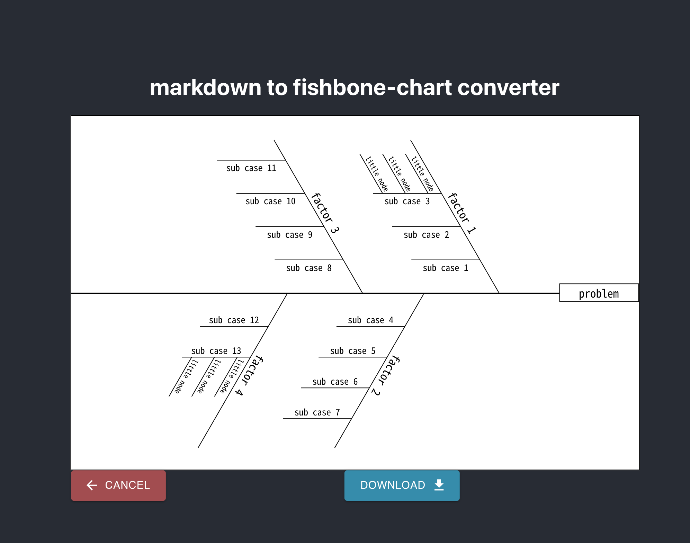

# Markdown to fishborn-chart converter

[デプロイページ](https://kohjean.github.io/markdown-to-fishborn-chart-converter/)

markdown 記法で書かれた箇条書きリストを特性要因図に変換します。
`*`, `+`, `-` 記号に対応します。記号と項目の間には半角スペースを 1 つ入れてください。
半角スペース 2 つ毎に深さレベルが上がります。(今後変更するかもしれません)

**サンプルデータ**
sampleDate.md

```md:sampleData.md
* problem
  * factor 1
    * sub case 1
    * sub case 2
    * sub case 3
      * little node
      * little node
      * little node 1
        out bound
  * factor 2
    * sub case 4
    * sub case 5
    * sub case 6
    * sub case 7
  * factor 3
    * sub case 8
    * sub case 9
    * sub case 10
    * sub case 11
  * factor 4
    * sub case 12
    * sub case 13
      * little node
      * little node
      * little node 2
```

**テキスト入力**


**ファイル選択**

**変換結果**


## 対応状況

- 項目が複数行にわたる時は表示がずれます。今後対応していきます。
- インデント 3 つまで。それ以上の要素は性格に正確に表示できません。今後さらに深い階層まで対応できるようにしていく予定です。
